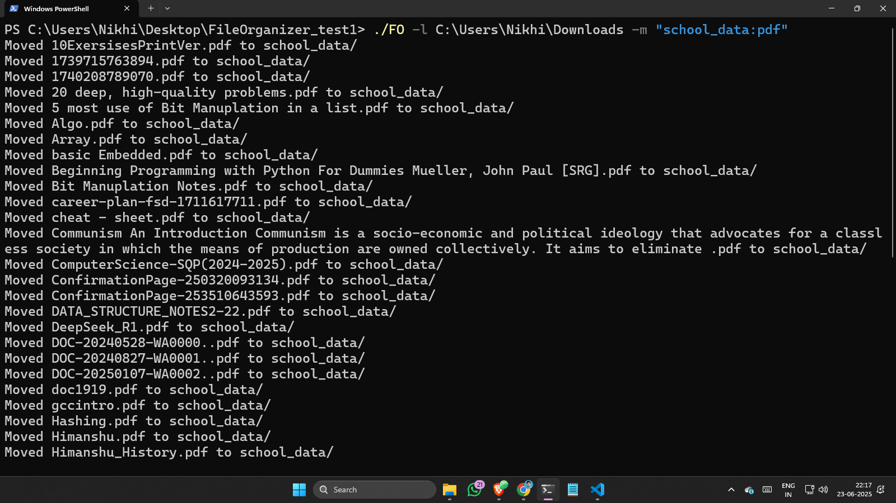
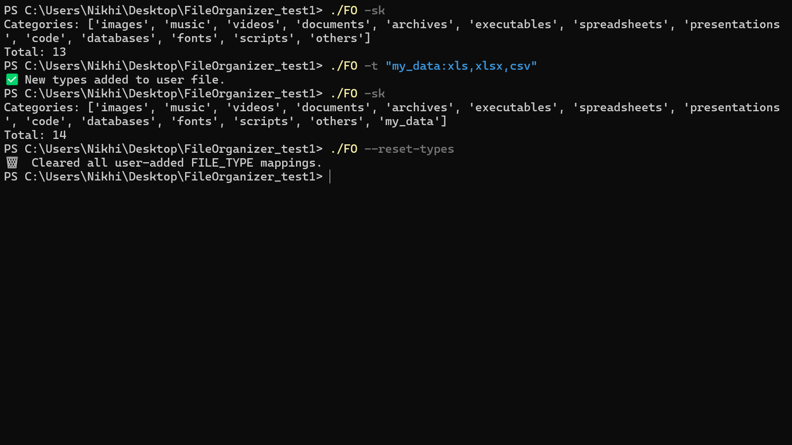
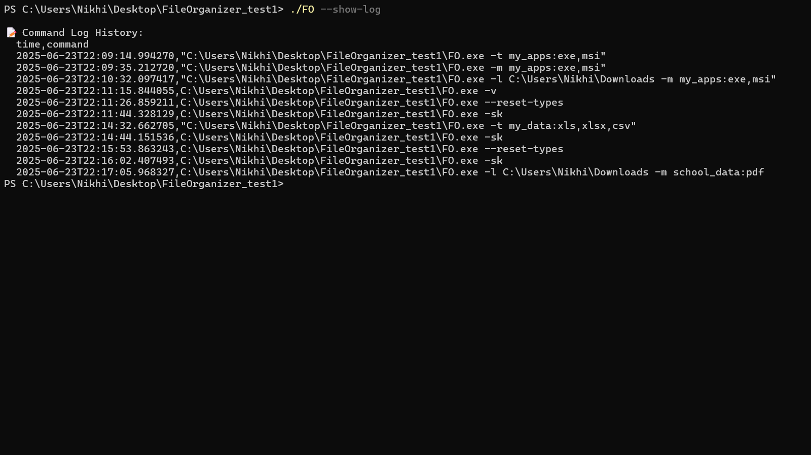

# FileOrganizer - v2.2

## What does it do?

**FileOrganizer** is a command-line tool designed to help you manage and organize your files efficiently. Whether you need to sort files by type, move them to different directories, or clean up your file system, FileOrganizer provides a simple yet powerful set of commands to streamline these tasks.

---

<p align="center"> 
<em>Before running FileOrganizer</em>
    <a href="./util/before.png" target="_blank"> 
     
    </a> 
<em>After running FileOrganizer</em> 
    <a href="util/after.png" target="_blank"> 
     
    </a> 
</p>

---

## ⚙️ Example Usage

### 1️⃣ Organize Files by Location
Organizes all supported file types into folders from the given location:

```bash
FO -l D:\\Downloads
````

Creates folders like `images/`, `documents/`, `videos/`, etc., and sorts files accordingly.

<p align="center">
  
</p>

---

### 2️⃣ Organize Only Specific Extensions

Organize selected extensions only (e.g., `.exe`, `.jpg`):

```bash
FO -l D:\\Downloads -s exe,jpg
```

Creates only the required folders like `exe/` and `jpg/`.

<p align="center">
  
</p>

---

### 3️⃣ Auto-Folder for Every Extension

Auto-creates a folder for each **unique extension** found:

```bash
FO -l D:\\Downloads -a
```

Useful for general cleanup by extension type.

<p align="center">
  
</p>

---

### 4️⃣ Custom Mapping for Extensions

You can move specific extensions to a **custom folder name**:

```bash
FO -m "school_data:pdf"
```

Moves all `.pdf` files to a folder named `school_data/`.

<p align="center"> 
    
</p>

---

### 5️⃣ Show or Modify File Type Categories

🔸 **Show current folder types (keys)**:

```bash
FO -sk
```

🔸 **Add new types dynamically**:

```bash
FO -t "courses:mp4,avi"
```

🔸 **Reset all user-added types**:

```bash
FO --reset-types
```

<p align="center"> 
    
</p>

---

### 6️⃣ View Command History Log

You can see all commands you've used (with timestamps):

```bash
FO --show-log
```

<p align="center"> 
    
</p>

---

## 🔧 Additional Commands

| Command            | Description                                  |
| ------------------ | -------------------------------------------- |
| `FO -h`            | Show help information and available commands |
| `FO --reset-types` | Reset all user-added mappings to default     |
| `FO --show-log`    | Show command history (CSV-style)             |
| `FO --commit`      | Git commit from CLI (internal dev use)       |

---

## 📦 Download and Installation

You can download the latest release from the [Release Versions](https://github.com/karnikhil90/FileOrganizer/releases) page.

For version history, check [Tags](https://github.com/karnikhil90/FileOrganizer/tags).

---

## 📄 License

This project is licensed under the MIT License - see the [LICENSE](LICENSE) file.

---

## 👨‍💻 About Me

Self-taught coder | Still Learning | Fluent in Java❤️ & Python | C/C++, Rust, & Basic Web Dev | Passionate about Embedded Systems ❤️

### 🌐 Connect with Me

[](https://www.linkedin.com/in/karnikhil90/)
[](https://x.com/karnikhil90)
[](https://linktr.ee/karnikhil90)