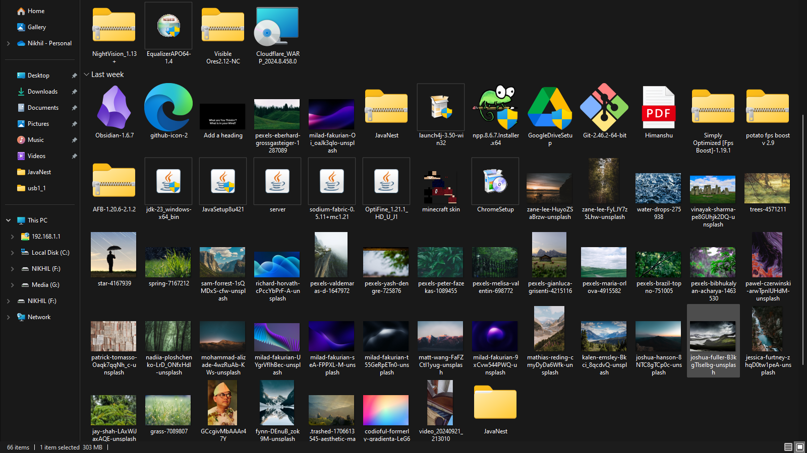

# FileOrganizer -v2.0

## What does it do?

FileOrganizer is a command-line tool designed to help you manage and organize your files efficiently. Whether you need to sort files by type, move them to different directories, or clean up your file system, FileOrganizer provides a simple yet powerful set of commands to streamline these tasks.

<p align="center"> 
<em>Before running FileOrganizer</em>
    <a href="./util/before.png" target="_blank"> 
     
    </a> 
<em>After running FileOrganizer</em> 
    <a href="util/after.png" target="_blank"> 
     
    </a> 
</p> 
<br>

### Example Usage

#### 1. Organizing by location:
To organize all files in the specified directory:

```bash
FO -l D:\\Downloads
```

This command will list and organize all files in the `D:\\Downloads` directory based on predefined categories such as images, documents, videos, and more.

<p align="center">
  
</p><br>

#### 2. Organizing specific file types:
You can specify which file types to organize using the `-s` argument. For example, to organize only `.exe` and `.png` files:

```bash
FO -l D:\\Downloads -s exe,jpg
```
<p align="center">
  <a href="./util/TargetedExtSorter/run.png" target="_blank"> 
     
    </a> 
</p><br>

This command will create folders named `exe/` and `jpg/` in the specified directory and move all `.exe` and `.jpg` files into their respective folders.

<p align="center"> 
<em>Before using `-s` option</em>
    <a href="./util/TargetedExtSorter/before.png" target="_blank"> 
     
    </a> 
<em>After using `-s` option</em> 
    <a href="util/TargetedExtSorter/after.png" target="_blank"> 
     
    </a> 
</p> 
<br>

#### 3. Creating folders for each extension:
If you want to create a new folder for every unique file extension in the directory, use the `-a` argument:

```bash
FO -l D:\\Downloads -a
```
<p align="center">
  <a href="./util/AutoExtFolders/run.png" target="_blank"> 
     
    </a> 
</p><br>

This command will organize every file in the specified directory by its extension, placing each file type in its own folder (e.g., `txt/`, `jpg/`, `mp3/`, etc.).

<p align="center"> 
<em>Before using `-a` option</em>
    <a href="./util/AutoExtFolders/before.png" target="_blank"> 
     
    </a> 
<em>After using `-a` option</em> 
    <a href="./util/AutoExtFolders/after.png" target="_blank"> 
     
    </a> 
</p> 
<br>

### Additional Commands

- `FO -h`: Show help information and available commands.

## Download and Installation

You can download the latest release from the [Release Versions](https://github.com/karnikhil90/FileOrganizer/releases) page.

For regular updates, visit the [Tags](https://github.com/karnikhil90/FileOrganizer/tags) section of the repository.

## License

This project is licensed under the MIT License - see the [LICENSE](LICENSE) file for details.

## About Me

Self-taught coder | Still Learning | Fluent in Java❤️ & Python | C/C++, Rust, & Basic Web Development | Passionate about Embedded Systems ❤️

### Connect with Me

[](https://www.linkedin.com/in/karnikhil90/)
[](https://x.com/karnikhil90)
[](https://linktr.ee/karnikhil90)
